```dot
digraph {
	graph [bgcolor="#F3DDB8" rankdir=LR]
	node [color="#26242F" penwidth=3.0]
	"Country music" [shape=circle]
	Blues [URL="/blues/"]
	Blues -> "Country music"
	"Appalachian music" [URL="/appalachian-music/"]
	"Appalachian music" -> "Country music"
	"Indigenous music of North America" [URL="/indigenous-music-of-north-america/"]
	"Indigenous music of North America" -> "Country music"
	"Norteño (music)" [URL="/norteno-music/"]
	"Norteño (music)" -> "Country music"
	"Cajun music" [URL="/cajun-music/"]
	"Cajun music" -> "Country music"
	"Gospel music" [URL="/gospel-music/"]
	"Gospel music" -> "Country music"
	"Texas country music" [URL="/texas-country-music/"]
	"Texas country music" -> "Country music"
	"Western music (North America)" [URL="/western-music-north-america/"]
	"Western music (North America)" -> "Country music"
	Spirituals [URL="/spirituals/"]
	Spirituals -> "Country music"
	"New Mexico music" [URL="/new-mexico-music/"]
	"New Mexico music" -> "Country music"
	"Old time fiddle" [URL="/old-time-fiddle/"]
	"Old time fiddle" -> "Country music"
	"Tejano music" [URL="/tejano-music/"]
	"Tejano music" -> "Country music"
	"Old-time music" [URL="/old-time-music/"]
	"Old-time music" -> "Country music"
	"Southern gospel" [URL="/southern-gospel/"]
	"Southern gospel" -> "Country music"
	Ranchera [URL="/ranchera/"]
	Ranchera -> "Country music"
	Cowpunk [URL="/cowpunk/"]
	"Country music" -> Cowpunk
	"K-pop" [URL="/k-pop/"]
	"Country music" -> "K-pop"
	"Texas country music" [URL="/texas-country-music/"]
	"Country music" -> "Texas country music"
	"Country pop" [URL="/country-pop/"]
	"Country music" -> "Country pop"
	"Bakersfield sound" [URL="/bakersfield-sound/"]
	"Country music" -> "Bakersfield sound"
	"Country rap" [URL="/country-rap/"]
	"Country music" -> "Country rap"
	"Jam band" [URL="/jam-band/"]
	"Country music" -> "Jam band"
	"Outlaw country" [URL="/outlaw-country/"]
	"Country music" -> "Outlaw country"
	"Country and Irish" [URL="/country-and-irish/"]
	"Country music" -> "Country and Irish"
	"Southern rock" [URL="/southern-rock/"]
	"Country music" -> "Southern rock"
	Countrycore [URL="/countrycore/"]
	"Country music" -> Countrycore
	"Country rock" [URL="/country-rock/"]
	"Country music" -> "Country rock"
	Zydeco [URL="/zydeco/"]
	"Country music" -> Zydeco
	"Rock music of West Bengal" [URL="/rock-music-of-west-bengal/"]
	"Country music" -> "Rock music of West Bengal"
	"Gothic country" [URL="/gothic-country/"]
	"Country music" -> "Gothic country"
	"Phleng phuea chiwit" [URL="/phleng-phuea-chiwit/"]
	"Country music" -> "Phleng phuea chiwit"
	"Schlager music" [URL="/schlager-music/"]
	"Country music" -> "Schlager music"
	"Christian country music" [URL="/christian-country-music/"]
	"Country music" -> "Christian country music"
	"Tulsa sound" [URL="/tulsa-sound/"]
	"Country music" -> "Tulsa sound"
	"Americana (music)" [URL="/americana-music/"]
	"Country music" -> "Americana (music)"
	Skiffle [URL="/skiffle/"]
	"Country music" -> Skiffle
	"Cowboy pop" [URL="/cowboy-pop/"]
	"Country music" -> "Cowboy pop"
	"Sertanejo music" [URL="/sertanejo-music/"]
	"Country music" -> "Sertanejo music"
	"Progressive country" [URL="/progressive-country/"]
	"Country music" -> "Progressive country"
	"Truck-driving country" [URL="/truck-driving-country/"]
	"Country music" -> "Truck-driving country"
	"Bluegrass music" [URL="/bluegrass-music/"]
	"Country music" -> "Bluegrass music"
	"Western swing" [URL="/western-swing/"]
	"Country music" -> "Western swing"
	"Neue Volksmusik" [URL="/neue-volksmusik/"]
	"Country music" -> "Neue Volksmusik"
	"Scrumpy and Western" [URL="/scrumpy-and-western/"]
	"Country music" -> "Scrumpy and Western"
	"Tejano music" [URL="/tejano-music/"]
	"Country music" -> "Tejano music"
	"Nashville sound" [URL="/nashville-sound/"]
	"Country music" -> "Nashville sound"
	"Southern soul" [URL="/southern-soul/"]
	"Country music" -> "Southern soul"
	"Alternative country" [URL="/alternative-country/"]
	"Country music" -> "Alternative country"
	"Swamp pop" [URL="/swamp-pop/"]
	"Country music" -> "Swamp pop"
	"Rock music" [URL="/rock-music/"]
	"Country music" -> "Rock music"
	"Rock and roll" [URL="/rock-and-roll/"]
	"Country music" -> "Rock and roll"
	"Swamp rock" [URL="/swamp-rock/"]
	"Country music" -> "Swamp rock"
	Dansband [URL="/dansband/"]
	"Country music" -> Dansband
	"Wong shadow" [URL="/wong-shadow/"]
	"Country music" -> "Wong shadow"
	"Thai pop music" [URL="/thai-pop-music/"]
	"Country music" -> "Thai pop music"
	"New Mexico music" [URL="/new-mexico-music/"]
	"Country music" -> "New Mexico music"
	"Roots rock" [URL="/roots-rock/"]
	"Country music" -> "Roots rock"
	"Western music (North America)" [URL="/western-music-north-america/"]
	"Country music" -> "Western music (North America)"
	"Heartland rock" [URL="/heartland-rock/"]
	"Country music" -> "Heartland rock"
	"Bro-country" [URL="/bro-country/"]
	"Country music" -> "Bro-country"
	Rockabilly [URL="/rockabilly/"]
	"Country music" -> Rockabilly
}
```

Country (also called country and western) is a genre of popular music that originated with blues, church music such as Southern gospel and spirituals, old-time, and American folk music forms including Appalachian, Cajun, Creole, Hawaiian, and the cowboy Western music styles of New Mexico, Red Dirt, Tejano, and Texas country. Its popularized roots originate in the Southern and Southwestern United States of the early 1920s.

## Influences

- [[Blues]]
- [[Appalachian music]]
- [[Indigenous music of North America]]
- [[Norteño (music)]]
- [[Cajun music]]
- [[Gospel music]]
- [[Texas country music]]
- [[Western music (North America)]]
- [[Spirituals]]
- [[New Mexico music]]
- [[Old time fiddle]]
- [[Tejano music]]
- [[Old-time music]]
- [[Southern gospel]]
- [[Ranchera]]

## Derivatives

- [[Cowpunk]]
- [[K-pop]]
- [[Texas country music]]
- [[Country pop]]
- [[Bakersfield sound]]
- [[Country rap]]
- [[Jam band]]
- [[Outlaw country]]
- [[Country and Irish]]
- [[Southern rock]]
- [[Countrycore]]
- [[Country rock]]
- [[Zydeco]]
- [[Rock music of West Bengal]]
- [[Gothic country]]
- [[Phleng phuea chiwit]]
- [[Schlager music]]
- [[Christian country music]]
- [[Tulsa sound]]
- [[Americana (music)]]
- [[Skiffle]]
- [[Cowboy pop]]
- [[Sertanejo music]]
- [[Progressive country]]
- [[Truck-driving country]]
- [[Bluegrass music]]
- [[Western swing]]
- [[Neue Volksmusik]]
- [[Scrumpy and Western]]
- [[Tejano music]]
- [[Nashville sound]]
- [[Southern soul]]
- [[Alternative country]]
- [[Swamp pop]]
- [[Rock music]]
- [[Rock and roll]]
- [[Swamp rock]]
- [[Dansband]]
- [[Wong shadow]]
- [[Thai pop music]]
- [[New Mexico music]]
- [[Roots rock]]
- [[Western music (North America)]]
- [[Heartland rock]]
- [[Bro-country]]
- [[Rockabilly]]
