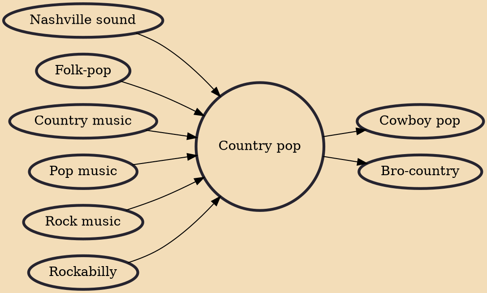

Country pop (also known as pop country or urban cowboy) is a fusion genre of country music and pop music that was developed by members of the country genre out of a desire to reach a larger, mainstream audience. Country pop music blends genres like rock, pop, and country, continuing similar efforts that began in the late 1950s, known originally as the Nashville sound and later on as Countrypolitan. By the mid-1970s, many country artists were transitioning to the pop-country sound, which led to some records' charting high on mainstream top 40 as well as the Billboard country chart. In-turn, many pop and easy listening artists crossed over to country charts during this time. After declining in popularity during the neotraditional movement of the 1980s, country pop had a comeback in the 1990s

## Influences

- [[Nashville sound]]
- [[Folk-pop]]
- [[Country music]]
- [[Pop music]]
- [[Rock music]]
- [[Rockabilly]]

## Derivatives

- [[Cowboy pop]]
- [[Bro-country]]
