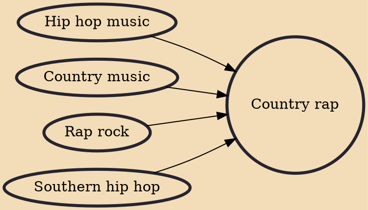

Country rap (or country hip hop and sometimes hick hop) is a fusion genre of popular music, blending country music with hip hop–style singing or rapping.

## Influences
- [[Hip hop music]]
- [[Country music]]
- [[Rap rock]]
- [[Southern hip hop]]
