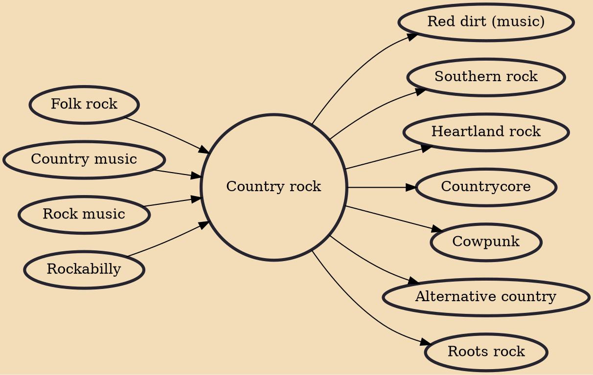

Country rock is a genre of music which fuses rock and country. It was developed by rock musicians who began to record country-flavored records in the late 1960s and early 1970s. These musicians recorded rock records using country themes, vocal styles, and additional instrumentation, most characteristically pedal steel guitars. Country rock began with artists like Buffalo Springfield, Michael Nesmith, Bob Dylan, Nitty Gritty Dirt Band, the Byrds, the Flying Burrito Brothers, The International Submarine Band and others, reaching its greatest popularity in the 1970s with artists such as Emmylou Harris, the Eagles, Linda Ronstadt, Michael Nesmith, Poco, Charlie Daniels Band, and Pure Prairie League. Country rock also influenced artists in other genres, including the Band, the Grateful Dead, Cr

## Influences
- [[Folk rock]]
- [[Country music]]
- [[Rock music]]
- [[Rockabilly]]

## Derivatives
- [[Red dirt (music)]]
- [[Southern rock]]
- [[Heartland rock]]
- [[Countrycore]]
- [[Cowpunk]]
- [[Alternative country]]
- [[Roots rock]]
