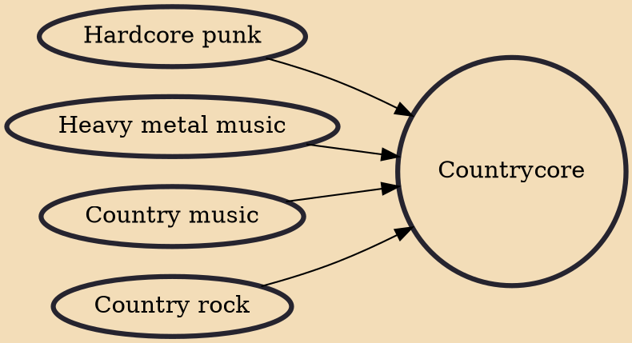

Countrycore is the combining of hardcore punk and heavy metal influences with country and country rock influences. Matanza, from Rio de Janeiro has been described as the first countrycore act. Later, bands such as Belmont and their single "Country Girl" have been described as countrycore.

## Influences
- [[Hardcore punk]]
- [[Heavy metal music]]
- [[Country music]]
- [[Country rock]]
