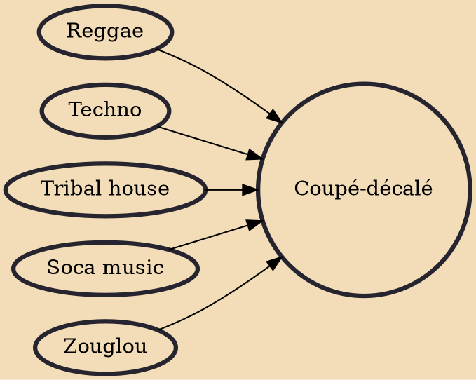

Coupé-décalé (French pronunciation: ​[kupe dekale]) is a type of popular dance music originating in Côte d'Ivoire/ Ivory Coast that Ivorians started using after the rise of ndombolo. Drawing heavily from zouglou and ndombolo with African influences, coupé-décalé is a very percussive style, featuring African samples, deep bass, and repetitive minimalist arrangements.

## Influences
- [[Reggae]]
- [[Techno]]
- [[Tribal house]]
- [[Soca music]]
- [[Zouglou]]
