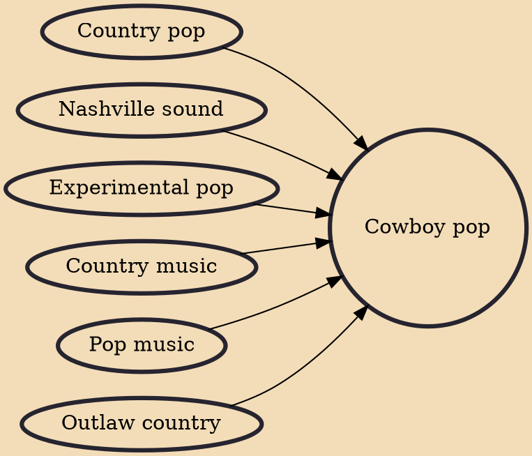

Cowboy pop is a term that was first coined by American music journalist J. D. Considine in his review of Rubber Rodeo's 1984 album Scenic Views. Although the term was coined in the 1980s, its usage since that time has been varied. In the late 2010s, the term began to be used to describe country-influenced indie rock and indie pop bands.

## Influences

- [[Country pop]]
- [[Nashville sound]]
- [[Experimental pop]]
- [[Country music]]
- [[Pop music]]
- [[Outlaw country]]
