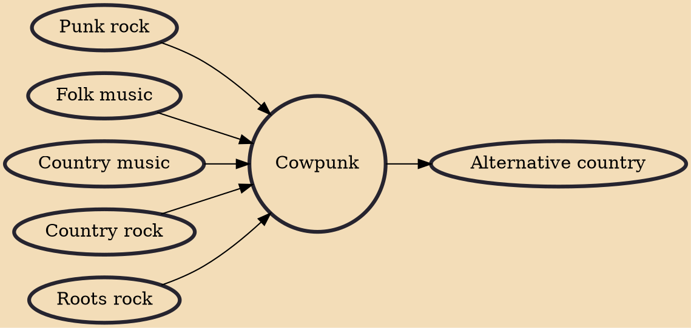

Cowpunk (or country punk) is a subgenre of punk rock that began in the United Kingdom and Southern California in the late 1970s - early 1980s. It combines punk rock or new wave with country, folk, and blues in its sound, lyrical subject matter, attitude, and style. Examples include Social Distortion, The Gun Club, The Long Ryders, Dash Rip Rock, Violent Femmes, The Blasters, Mojo Nixon, Meat Puppets, The Beat Farmers, Rubber Rodeo, Rank and File, and Jason and the Scorchers. Many of the musicians in this scene subsequently became associated with alternative country, roots rock or Americana.

## Influences

- [[Punk rock]]
- [[Folk music]]
- [[Country music]]
- [[Country rock]]
- [[Roots rock]]

## Derivatives

- [[Alternative country]]
