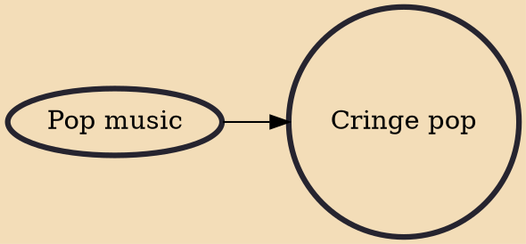

Cringe pop is a genre of pop music, which is written intentionally to be cringeworthy. It is a broad category that encompasses songs and music videos that are essentially awkward in nature. This awkwardness is intentionally produced for the purpose of going viral. The element of how cringeworthy the music is determines the virality of the song.

## Influences

- [[Pop music]]
