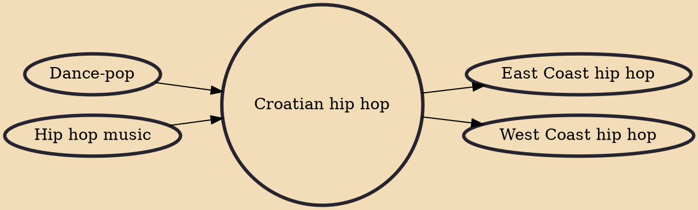

Croatian hip hop is a genre of music, and a culture that covers a variety of styles of hip hop music made in Croatia. Croatian hip hop was originally influenced by the American hip hop scene and introduced to Croatia in the mid 1990s. Croatian hip hop, particularly that originating from Rijeka and Zagreb in the 1990s, was mainly concentrated on social issues due to the corruptive system of government at the time. In the 2000s, Croatian hip hop started becoming more mainstream and it spread to Split developing its own hip hop style.

## Influences
- [[Dance-pop]]
- [[Hip hop music]]

## Derivatives
- [[East Coast hip hop]]
- [[West Coast hip hop]]
