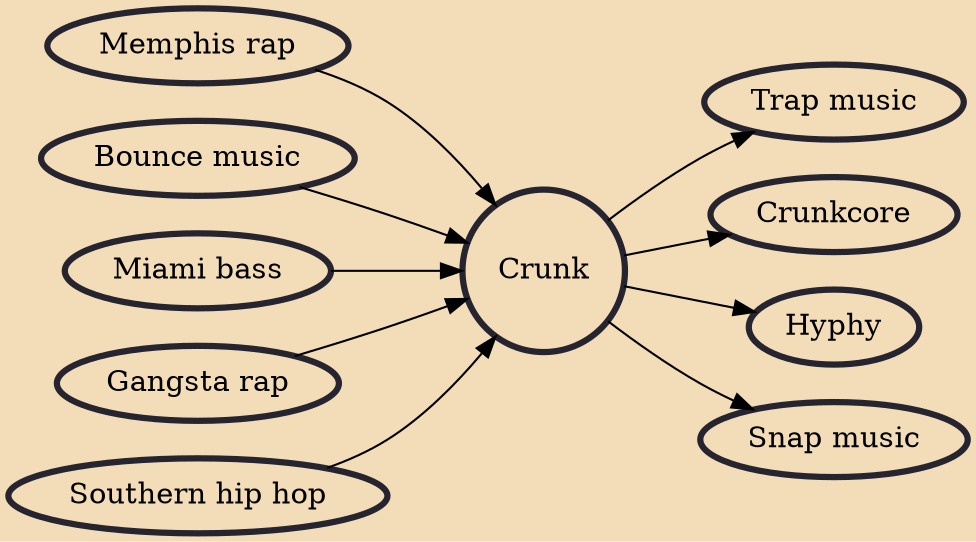

Crunk is a subgenre of hip hop music that emerged in the early 1990s and gained mainstream success during the mid 2000s. Crunk is often up-tempo and one of Southern hip hop's more dance and club oriented subgenres. An archetypal crunk track frequently uses a main groove consisting of layered keyboard synths, a drum machine clapping rhythm, heavy basslines, and shouting vocals, often in a call and response manner. The term "crunk" was also used throughout the 2000s as a blanket term to denote any style of Southern hip hop, a side effect of the genre's breakthrough to the mainstream. The word derives from its African-American slang past-participle form, "crunk", of the verb "to crank" (as in the phrase "crank up"). It refers to being excited or high on drugs.

## Influences
- [[Memphis rap]]
- [[Bounce music]]
- [[Miami bass]]
- [[Gangsta rap]]
- [[Southern hip hop]]

## Derivatives
- [[Trap music]]
- [[Crunkcore]]
- [[Hyphy]]
- [[Snap music]]
