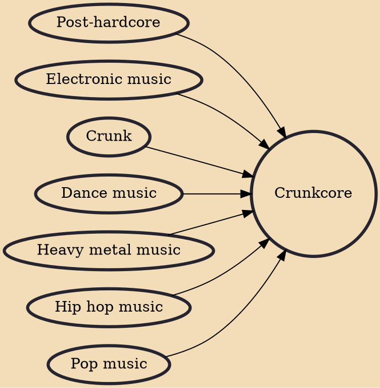

Crunkcore (also known as crunk punk and scrunk) is a musical fusion genre characterized by the combination of musical elements from crunk, post-hardcore, heavy metal, pop, electronic and dance music. The genre often features screamed vocals, hip hop beats, and sexually provocative lyrics. The genre developed from members of the scene subculture during the mid 2000s.

## Influences

- [[Post-hardcore]]
- [[Electronic music]]
- [[Crunk]]
- [[Dance music]]
- [[Heavy metal music]]
- [[Hip hop music]]
- [[Pop music]]
