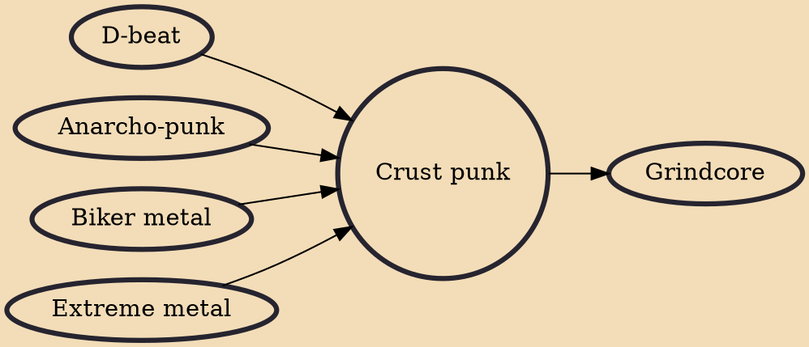

Crust punk (also known as crust or stenchcore) is a form of music influenced by English punk rock and extreme metal. The style, which evolved in the early 1980s in England, often has songs with dark and pessimistic lyrics that linger on political and social ills. The term "crust" was coined by Hellbastard on their 1986 Ripper Crust demo.

## Influences

- [[D-beat]]
- [[Anarcho-punk]]
- [[Biker metal]]
- [[Extreme metal]]

## Derivatives

- [[Grindcore]]
