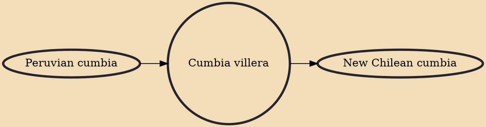

Cumbia villera (locally [ˈkumbja βiˈʒeɾa] or [ˈkumbja βiˈʃeɾa]) (roughly translated as "slum cumbia", "ghetto cumbia" or "shantytown cumbia") is a subgenre of cumbia music originated in Argentina in the late 1990s and popularized all over Latin America and the Latin communities abroad. For its characteristics, cumbia villera has been compared to gangsta rap, reggaeton, rock rolinga, raggamuffin, baile funk, and narcocorrido, among other music genres.

## Influences
- [[Peruvian cumbia]]

## Derivatives
- [[New Chilean cumbia]]
