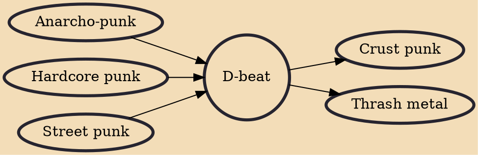

D-beat (also known as Discore, kängpunk, Discrust, and crust-beat) is a style of hardcore punk, developed in the early 1980s by imitators of Discharge, after whom the genre is named, as well as a drum beat characteristic of this subgenre. D-beat is known for its "grinding, distorted and brutally political" sound. Discharge may have themselves inherited the beat from Motörhead and the Buzzcocks. D-beat is closely associated with crust punk, which is a heavier, more complex variation. The style was particularly popular in Sweden, and developed there by groups such as Crude SS, Anti Cimex, Mob 47, and Driller Killer. Other D-beat groups include Doom and the Varukers from the UK; Disclose from Japan; Crucifix and Final Conflict from the U.S.; Ratos de Porão from Brazil; and MG15 from Spain. Wh

## Influences

- [[Anarcho-punk]]
- [[Hardcore punk]]
- [[Street punk]]

## Derivatives

- [[Crust punk]]
- [[Thrash metal]]
