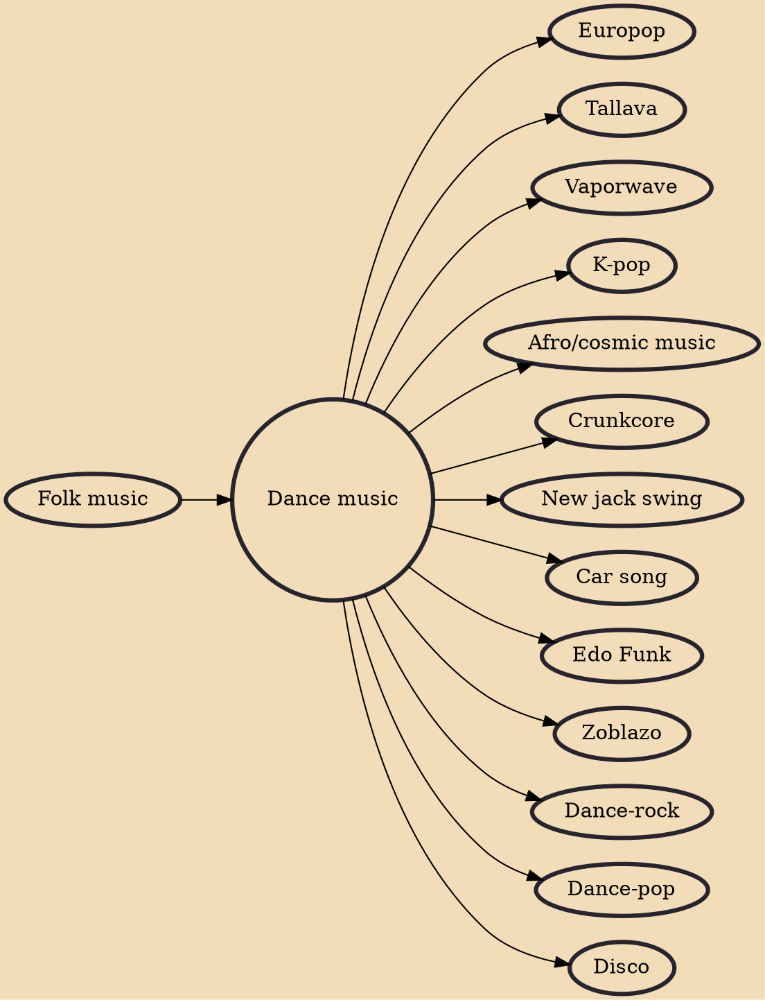

Dance music is music composed specifically to facilitate or accompany dancing. It can be either a whole musical piece or part of a larger musical arrangement. In terms of performance, the major categories are live dance music and recorded dance music. While there exist attestations of the combination of dance and music in ancient times (for example Ancient Greek vases sometimes show dancers accompanied by musicians), the earliest Western dance music that we can still reproduce with a degree of certainty are old fashioned dances. In the Baroque period, the major dance styles were noble court dances (see Baroque dance). In the classical music era, the minuet was frequently used as a third movement, although in this context it would not accompany any dancing. The waltz also arose later in the

## Influences
- [[Folk music]]

## Derivatives
- [[Europop]]
- [[Tallava]]
- [[Vaporwave]]
- [[K-pop]]
- [[Afro/cosmic music]]
- [[Crunkcore]]
- [[New jack swing]]
- [[Car song]]
- [[Edo Funk]]
- [[Zoblazo]]
- [[Dance-rock]]
- [[Dance-pop]]
- [[Disco]]
