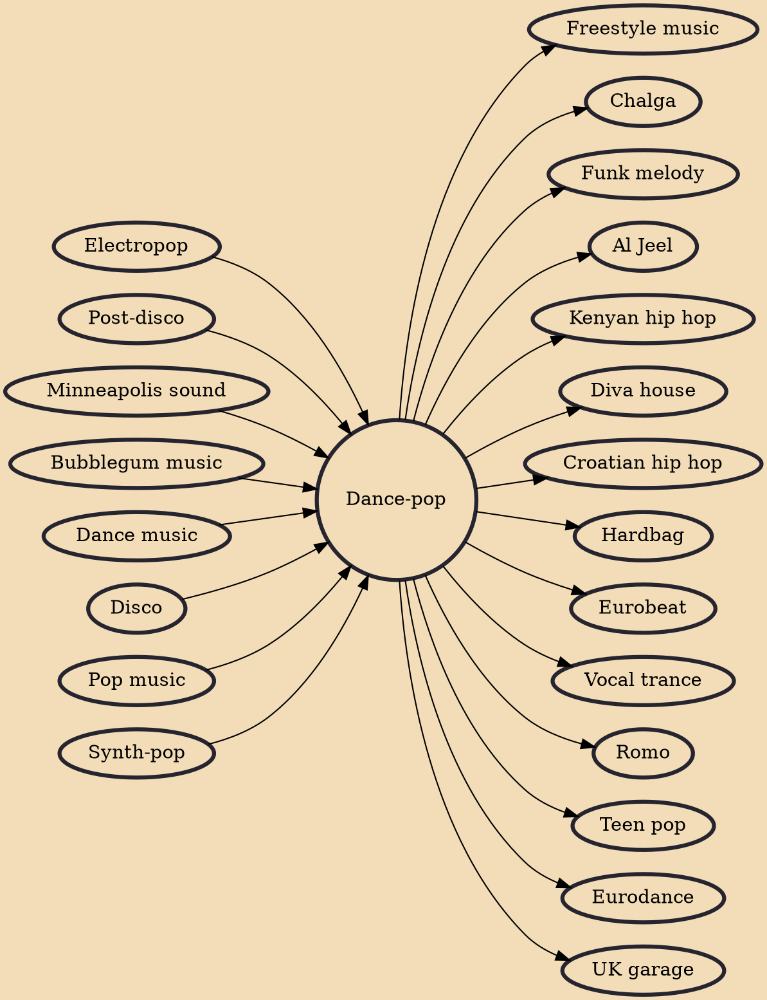

Dance-pop is a popular music subgenre that originated in the late 1970s to early 1980s. It is generally uptempo music intended for nightclubs with the intention of being danceable but also suitable for contemporary hit radio. Developing from a combination of dance and pop with influences of disco, post-disco and synth-pop, it is generally characterised by strong beats with easy, uncomplicated song structures which are generally more similar to pop music than the more free-form dance genre, with an emphasis on melody as well as catchy tunes. The genre, on the whole, tends to be producer-driven, despite some notable exceptions.

## Influences
- [[Electropop]]
- [[Post-disco]]
- [[Minneapolis sound]]
- [[Bubblegum music]]
- [[Dance music]]
- [[Disco]]
- [[Pop music]]
- [[Synth-pop]]

## Derivatives
- [[Freestyle music]]
- [[Chalga]]
- [[Funk melody]]
- [[Al Jeel]]
- [[Kenyan hip hop]]
- [[Diva house]]
- [[Croatian hip hop]]
- [[Hardbag]]
- [[Eurobeat]]
- [[Vocal trance]]
- [[Romo]]
- [[Teen pop]]
- [[Eurodance]]
- [[UK garage]]
