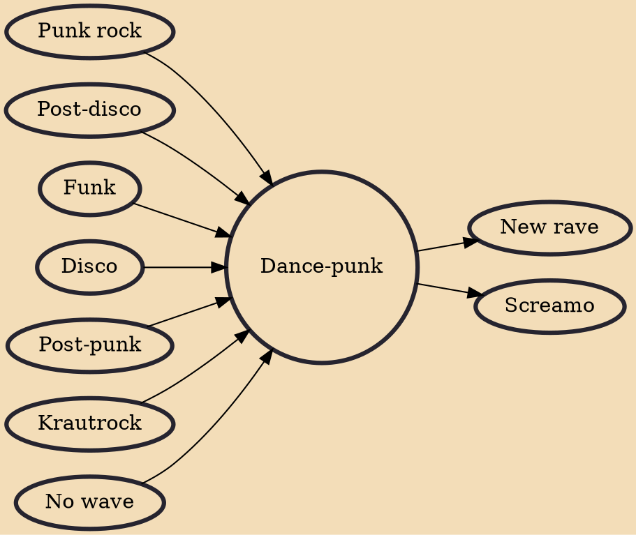

Dance-punk (also known as disco-punk, punk-funk or techno-punk) is a post-punk subgenre that emerged in the late 1970s, and is closely associated with the disco, post-disco and new wave movements.

## Influences
- [[Punk rock]]
- [[Post-disco]]
- [[Funk]]
- [[Disco]]
- [[Post-punk]]
- [[Krautrock]]
- [[No wave]]

## Derivatives
- [[New rave]]
- [[Screamo]]
