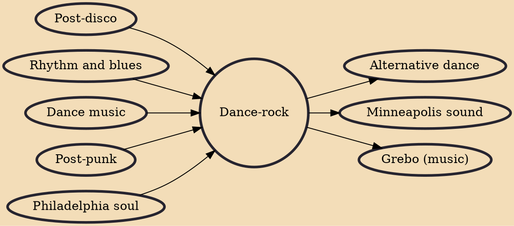

Dance-rock is a disco/dance-infused genre of rock music. It is a post-disco genre connected with pop rock and post-punk with fewer rhythm and blues influences. It originated in the early 1980s, following the decline in popularity of both punk and disco. Examples of early dance-rock include Gina X's "No G.D.M.", Russ Ballard's "On the Rebound", artists such as Dinosaur L, Liquid Liquid and Polyrock, and the compilation album Disco Not Disco.

## Influences
- [[Post-disco]]
- [[Rhythm and blues]]
- [[Dance music]]
- [[Post-punk]]
- [[Philadelphia soul]]

## Derivatives
- [[Alternative dance]]
- [[Minneapolis sound]]
- [[Grebo (music)]]
