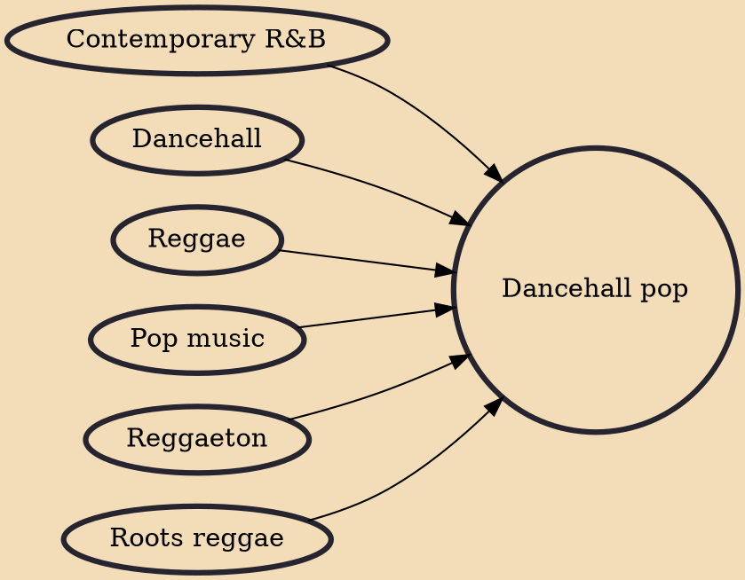

Dancehall pop is a sub-genre of the Jamaican genre dancehall that originated in the early 2000s. Developing from the sounds of reggae, dancehall pop is characteristically different in its fusion with western pop music and digital music production. Dancehall pop is also different from dancehall in that most songs use lesser Jamaican Patois in lyrics––allowing it to be globally understood and consumed. It also incorporates the key pop music elements of having melodies, hooks, and the verse-chorus format. Additionally, the genre moves away from the reggae and roots reggae music origins in social and political protest, now lyrically centering on partying, dancing, and sexuality.

## Influences
- [[Contemporary R&B]]
- [[Dancehall]]
- [[Reggae]]
- [[Pop music]]
- [[Reggaeton]]
- [[Roots reggae]]
