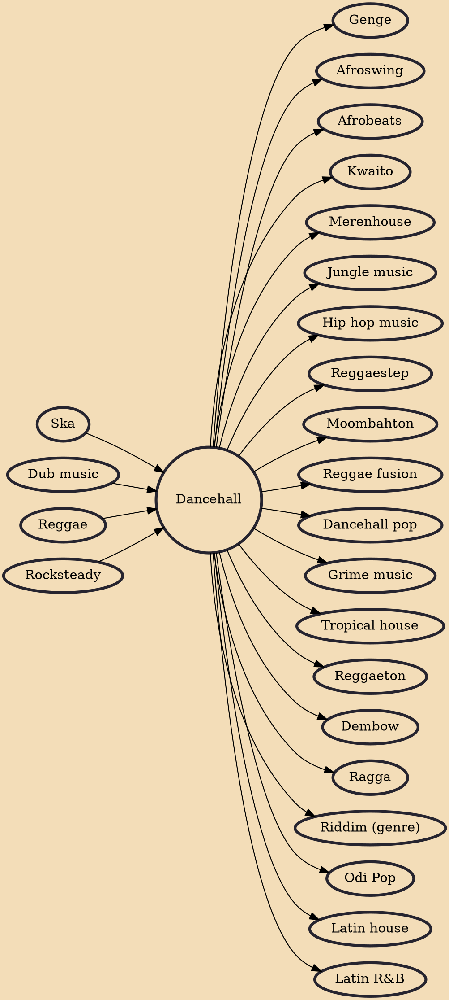

Dancehall is a genre of Jamaican popular music that originated in the late 1970s. Initially, dancehall was a more sparse version of reggae than the roots style, which had dominated much of the 1970s. In the mid-1980s, digital instrumentation became more prevalent, changing the sound considerably, with digital dancehall (or "ragga") becoming increasingly characterized by faster rhythms. Key elements of dancehall music include its extensive use of Jamaican Patois rather than Jamaican standard English and a focus on the track instrumentals (or "riddims").

## Influences
- [[Ska]]
- [[Dub music]]
- [[Reggae]]
- [[Rocksteady]]

## Derivatives
- [[Genge]]
- [[Afroswing]]
- [[Afrobeats]]
- [[Kwaito]]
- [[Merenhouse]]
- [[Jungle music]]
- [[Hip hop music]]
- [[Reggaestep]]
- [[Moombahton]]
- [[Reggae fusion]]
- [[Dancehall pop]]
- [[Grime music]]
- [[Tropical house]]
- [[Reggaeton]]
- [[Dembow]]
- [[Ragga]]
- [[Riddim (genre)]]
- [[Odi Pop]]
- [[Latin house]]
- [[Latin R&B]]
