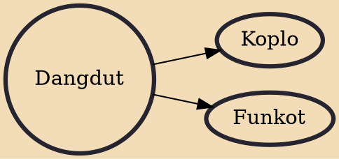

Dangdut (/dɑːŋˈduːt/) is a genre of Indonesian folk music that is partly derived and fused from Hindustani, Arabic and to lesser extent, Malay and local folk music. Dangdut is a most popular musical genre in Indonesia and a very popular in other Malay world countries as well because of its melodious instrumentation and vocals. Dangdut features a tabla and gendang beat.

## Derivatives

- [[Koplo]]
- [[Funkot]]
