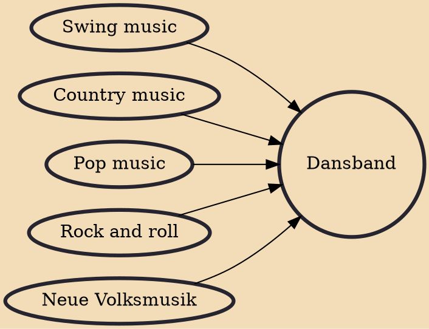

Dansband (Swedish pronunciation: [ˈdânsˌband]; "dance band"), or danseband in Norwegian and Danish, is a Swedish term for a band that plays dansbandsmusik [ˈdânsˌbandsmɵˌsiːk] ("dance band music"). Dansbandsmusik is often danced to in pairs. Jitterbug and foxtrot music are often included in this category. The music is primarily inspired by swing, schlager, country, jazz, and rock. The main influence for rock-oriented bands is the rock music of the 1950s and 1960s.

## Influences

- [[Swing music]]
- [[Country music]]
- [[Pop music]]
- [[Rock and roll]]
- [[Neue Volksmusik]]
