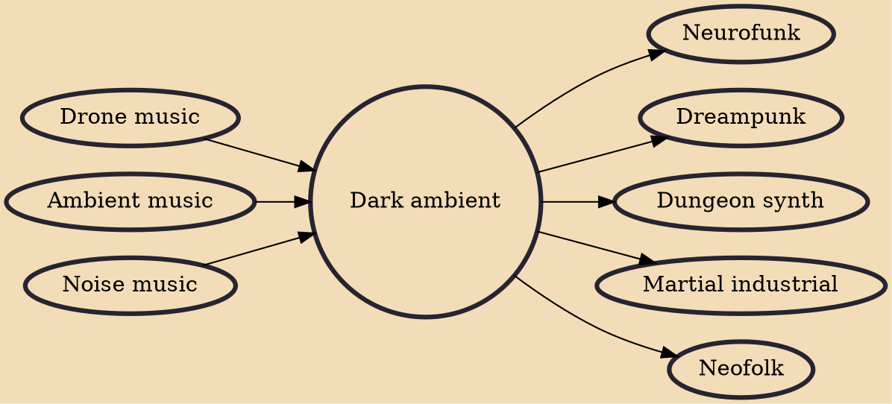

Dark ambient (referred to as ambient industrial especially in the 1980s) is a genre of post-industrial music that features an ominous, dark droning and often gloomy, monumental or catacombal atmosphere, partially with discordant overtones. It shows similarities with ambient music, a genre that has been cited as a main influence by many dark ambient artists, both conceptually and compositionally. Although mostly electronically generated, dark ambient also includes the sampling of hand-played instruments and semi-acoustic recording procedures.

## Influences
- [[Drone music]]
- [[Ambient music]]
- [[Noise music]]

## Derivatives
- [[Neurofunk]]
- [[Dreampunk]]
- [[Dungeon synth]]
- [[Martial industrial]]
- [[Neofolk]]
