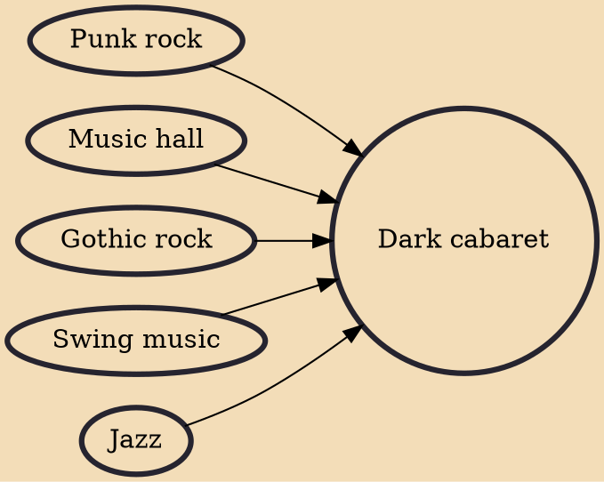

Dark cabaret has come to define a particular musical genre that draws on the aesthetics of burlesque, vaudeville and Weimar-era cabaret, with live performances that borrow from the stylings of goth and punk.

## Influences

- [[Punk rock]]
- [[Music hall]]
- [[Gothic rock]]
- [[Swing music]]
- [[Jazz]]
