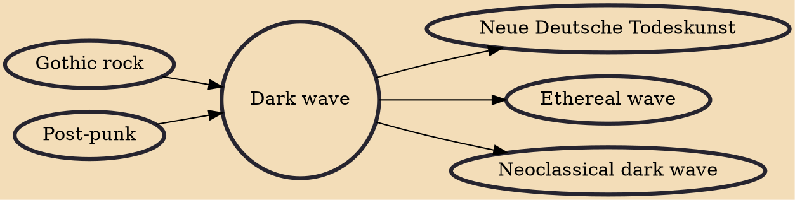

Dark wave (also typeset as darkwave) is a music genre that emerged from the new wave and post-punk movement of the late 1970s. Dark wave compositions are largely based on minor key tonality and introspective lyrics and have been perceived as being dark, romantic and bleak, with an undertone of sorrow. The genre embraces a range of styles including cold wave, ethereal wave, gothic rock, neoclassical dark wave and neofolk.

## Influences

- [[Gothic rock]]
- [[Post-punk]]

## Derivatives

- [[Neue Deutsche Todeskunst]]
- [[Ethereal wave]]
- [[Neoclassical dark wave]]
