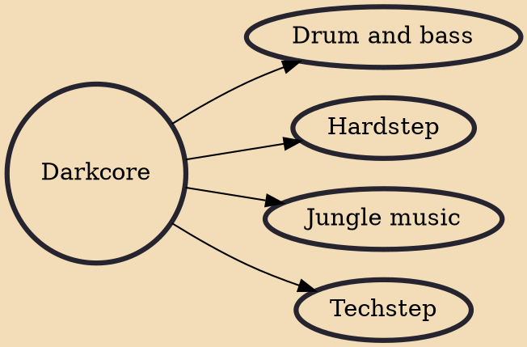

Darkcore (also referred to as darkside hardcore) is a genre of electronic dance music, considered to be a subgenre of breakbeat hardcore, which came out from the UK rave scene of the early 1990s; this genre in particular emerged from late 1992. It is recognised as being one of the direct precursors of the music genre now known as drum and bass.

## Derivatives

- [[Drum and bass]]
- [[Hardstep]]
- [[Jungle music]]
- [[Techstep]]
