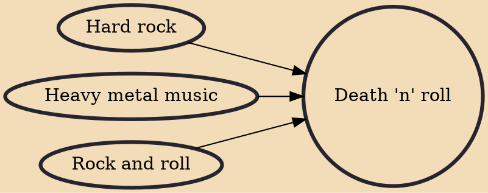

Death 'n' roll (portmanteau of death metal and rock 'n' roll) is the subgenre of death metal music that incorporates hard rock-inspired elements to the overall sound. The achieved effect is that of death metal's trademark combination of growled vocals and highly distorted detuned guitar riffing with elements reminiscent of 1970s hard rock and heavy metal. Notable examples include Entombed, Gorefest, Carcass, Six Feet Under, Pungent Stench and the Fernando Colunga Ultimate Experience.

## Influences

- [[Hard rock]]
- [[Heavy metal music]]
- [[Rock and roll]]
