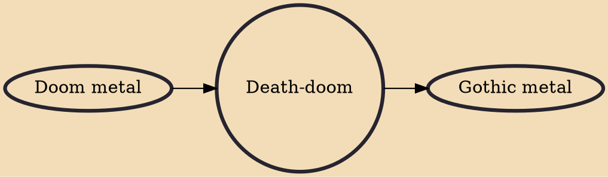

Death-doom is an extreme subgenre of heavy metal. It combines the slow tempos and pessimistic or depressive mood of doom metal with the deep growling vocals and double kick drumming of death metal. The genre emerged in the late-1980s and gained a certain amount of popularity during the 1990s, but had become less common by the turn of the 21st century. In turn, death-doom gave rise to the closely related genre of funeral doom as well as to the more melodic, gloomy and romantic gothic metal.

## Influences

- [[Doom metal]]

## Derivatives

- [[Gothic metal]]
