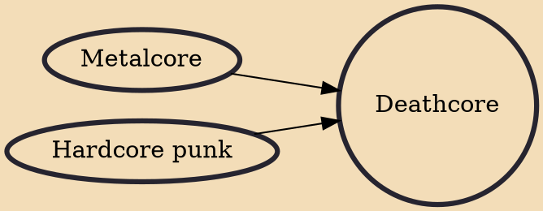

Deathcore is an extreme metal subgenre that combines death metal with metalcore. The genre consists of death metal guitar riffs, blast beats, and metalcore breakdowns. While there are some precursors to the concept of death metal fused with metalcore/hardcore elements seen in the 1990s, deathcore itself emerged in the early 2000s and gained prominence beginning in the mid-2000s within the southwestern United States, especially Arizona and inland southern California (mostly the Coachella Valley), which are home to many notable bands and various festivals.

## Influences
- [[Metalcore]]
- [[Hardcore punk]]
