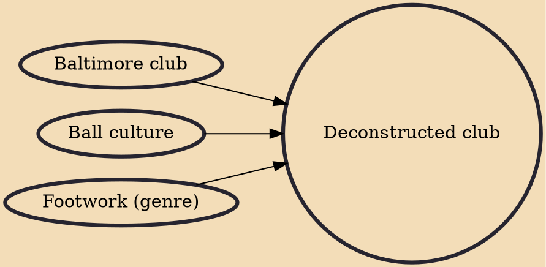

Deconstructed club, also known as post-club or deconstructed music is an experimental style of electronic dance music characterized by a post-modernist approach and an abrasive or dystopian tone. It stands opposed to the tropes of mainstream club styles, often dispensing with four-on-the-floor beats and stable tempo while mixing eclectic or abrasive sources.

## Influences

- [[Baltimore club]]
- [[Ball culture]]
- [[Footwork (genre)]]
