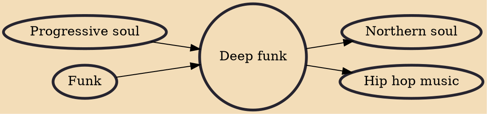

Deep funk is a subgenre of funk music which features a "hard, lean" sound and emphasis on groove, improvisation, and musicianship over traditional songwriting. The term is also used to describe rare funk recordings sought out by collectors and DJs. Artists such as James Brown and the Meters were basic reference points for the style.

## Influences

- [[Progressive soul]]
- [[Funk]]

## Derivatives

- [[Northern soul]]
- [[Hip hop music]]
