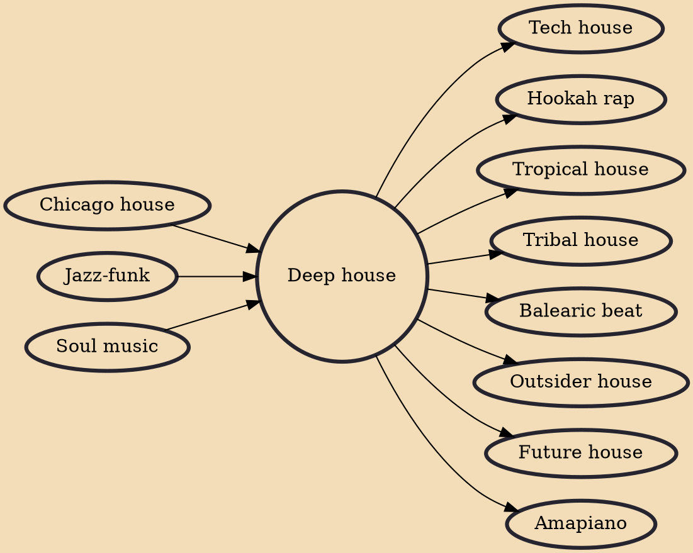

Deep house (110~125 BPM) is a subgenre of house music that originated in the 1980s, initially fusing elements of Chicago house with the lush chords of 1980s jazz-funk and touches of soul music. Its origins are attributed to the early recordings of Larry Heard (aka Mr. Fingers), including his influential track "Can You Feel It".

## Influences
- [[Chicago house]]
- [[Jazz-funk]]
- [[Soul music]]

## Derivatives
- [[Tech house]]
- [[Hookah rap]]
- [[Tropical house]]
- [[Tribal house]]
- [[Balearic beat]]
- [[Outsider house]]
- [[Future house]]
- [[Amapiano]]
