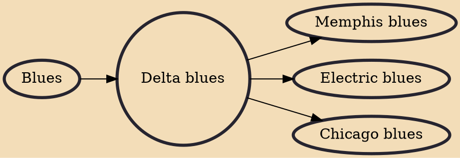

Delta blues is one of the earliest-known styles of blues. It originated in the Mississippi Delta, and is regarded as a regional variant of country blues. Guitar and harmonica are its dominant instruments; slide guitar is a hallmark of the style. Vocal styles in Delta blues range from introspective and soulful to passionate and fiery.

## Influences

- [[Blues]]

## Derivatives

- [[Memphis blues]]
- [[Electric blues]]
- [[Chicago blues]]
