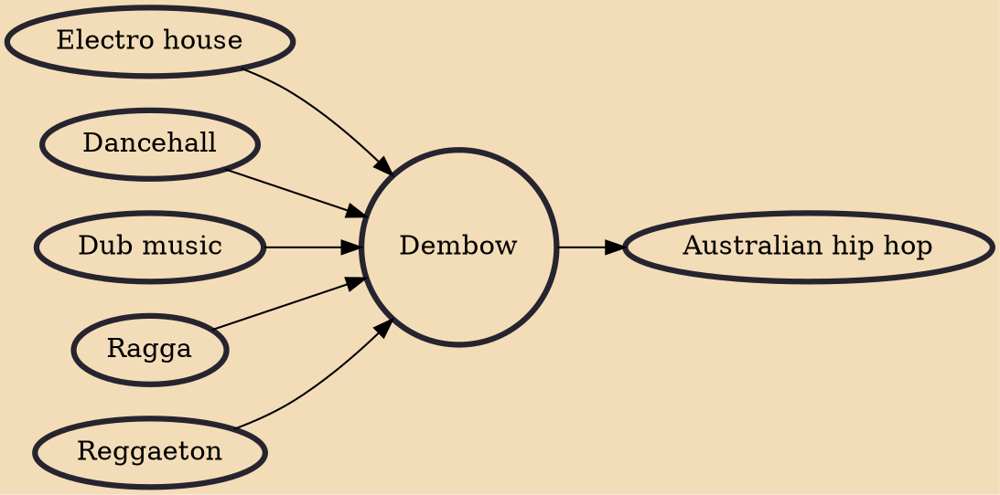

Dembow is a Dominican musical genre that can be traced to a riddim that originated in Jamaican dancehall. When Shabba Ranks released "Dem Bow" in 1990, it did not take long for the dembow genre to form. Riddims were built from the song and the sound became a popular part of reggaeton. From there it took off in Dominican Republic creating the sound UNDERWORLD ("Bajo Mundo" in Spanish). It hit the streets of New York and from there it made its way to all of Latin America. The Dominican Dembow sound keeps evolving and has been fusioned with Trap music since 2016 and it's also fused with Bachata and Merengue from the Dominican Republic. Dembow artists are called "Dembowseros"

## Influences

- [[Electro house]]
- [[Dancehall]]
- [[Dub music]]
- [[Ragga]]
- [[Reggaeton]]

## Derivatives

- [[Australian hip hop]]
