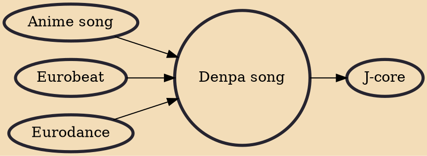

A denpa song (電波ソング) is a type of Japanese music that is intentionally strange and catchy. Common features of denpa songs include intentionally off-key vocals, nonsensical lyrics and an over-the-top tune. Denpa music has grown into a subculture within Japan, forming a significant aspect of otaku culture and has large numbers of dōjin circles and music artists dedicated to denpa music. Denpa is not a specific genre in itself, but rather an umbrella term for various kinds of music.

## Influences

- [[Anime song]]
- [[Eurobeat]]
- [[Eurodance]]

## Derivatives

- [[J-core]]
