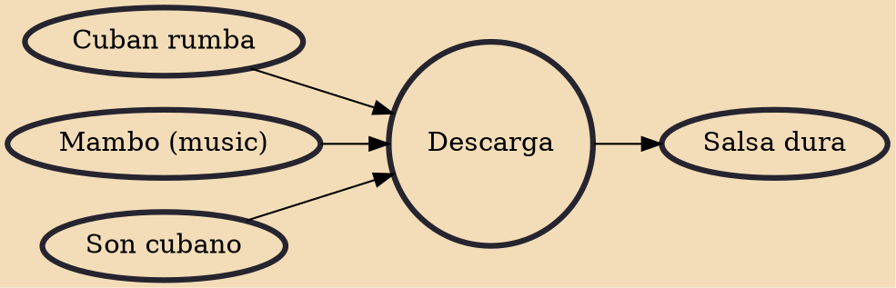

A descarga (literally discharge in Spanish) is an improvised jam session consisting of variations on Cuban music themes, primarily son montuno, but also guajira, bolero, guaracha and rumba. The genre is strongly influenced by jazz and it was developed in Havana during the 1950s. Important figures in the emergence of the genre were Cachao, Julio Gutiérrez, Bebo Valdés, Peruchín and Niño Rivera in Cuba, and Tito Puente, Machito and Mario Bauzá in New York. Originally, descargas were promoted by record companies such as Panart, Maype and Gema under the label Cuban jam sessions. From the 1960s, the descarga format was usually adapted by large salsa ensembles, most notably the Fania All-Stars.

## Influences
- [[Cuban rumba]]
- [[Mambo (music)]]
- [[Son cubano]]

## Derivatives
- [[Salsa dura]]
