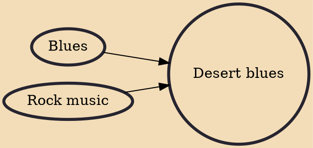

Tishoumaren (ⵜⵉⵛⵓⵎⴰⵔⴻⵏ in Neo-Tifinagh script) or assouf, internationally known as desert blues, is a style of music from the Sahara region of northern and west Africa. Critics describe the music as a fusion of blues and rock music with Tuareg, Malian or North African music. Various other terms are used to describe it including desert rock, Saharan rock, Takamba, Mali blues, Tuareg rock or simply "guitar music". The style has been pioneered by Tuareg musicians in the Sahara region, particularly in Mali, Niger, Libya, Western Sahara, Algeria, Burkina Faso and others.

## Influences
- [[Blues]]
- [[Rock music]]
