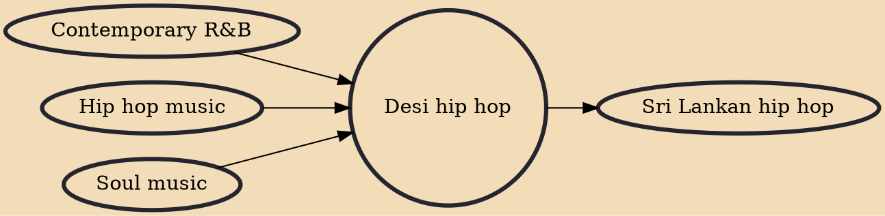

Desi hip hop is a term for music and culture which combines the influences of hip hop and the Indian subcontinent; the term desi referring to the South Asian diaspora. The term has also come to be used as an alternative for rap music and even pop music which involves rappers of South Asian origins.

## Influences

- [[Contemporary R&B]]
- [[Hip hop music]]
- [[Soul music]]

## Derivatives

- [[Sri Lankan hip hop]]
