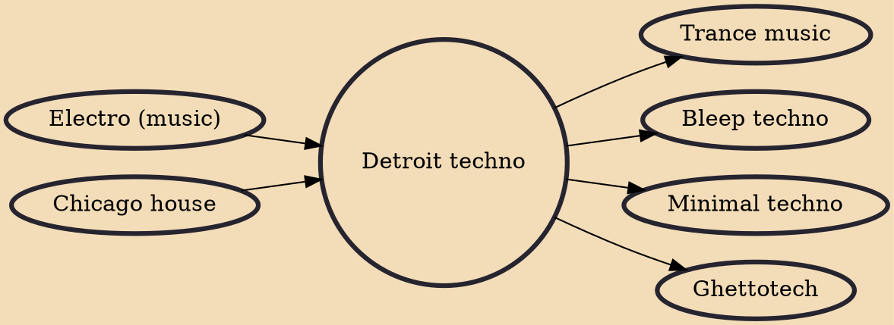

Detroit techno is a type of techno music that generally includes the first techno productions by Detroit-based artists during the 1980s and early 1990s. Prominent Detroit techno artists include Juan Atkins, Eddie Fowlkes, Derrick May, Jeff Mills, Kevin Saunderson, Blake Baxter, Drexciya, Mike Banks, and Robert Hood.

## Influences
- [[Electro (music)]]
- [[Chicago house]]

## Derivatives
- [[Trance music]]
- [[Bleep techno]]
- [[Minimal techno]]
- [[Ghettotech]]
