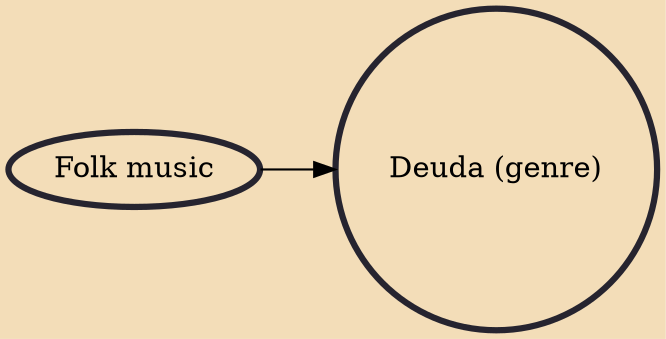

Deuda (Nepali: देउडा) or Deuda Khel is a Nepali genre of song and dance, performed in the Sudurpashchim and Karnali provinces of Nepal, as well as in the Kumaon Division of Uttarakhand state of India. It is performed on the occasion of various festivals, such as Gaura. The dance is performed by singing Deuda songs in a circulus by holding each-other's hands. It is considered as one of the cultural heritage of Karnali Province.

## Influences

- [[Folk music]]
