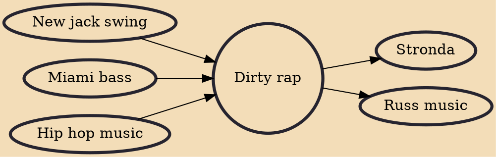

Dirty rap (also known as porno rap, porn rap, sex rap, booty rap, or pornocore) is a subgenre of hip hop music that contains lyrical content revolving mainly around sexually explicit subjects. The lyrics are often overtly explicit and graphic, sometimes to the point of being comical or offensive. Historically, dirty rap often contained a distinctly bass-driven sound, which arose from the popular Miami bass rap scene. However, dirty rap has recently been heavily influenced by Baltimore club, ghetto house, and ghettotech. Many dirty rap songs have been used as soundtracks to pornographic movies since the 2000s, replacing the traditional porn groove.

## Influences
- [[New jack swing]]
- [[Miami bass]]
- [[Hip hop music]]

## Derivatives
- [[Stronda]]
- [[Russ music]]
