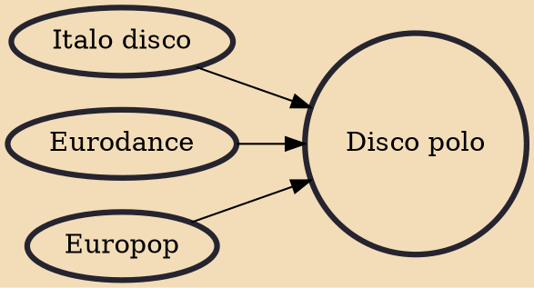

Disco polo is a genre of popular dance music, created in Poland in the 1980s, it was initially known as "sidewalk music" (Polish: muzyka chodnikowa) or "backyard music" (Polish: muzyka podwórkowa). This genre, being a part of the musical folklore, had great popularity in the 1990s, with its peak in 1995-1997. Then came a gradual decline in the popularity of this genre, which made the last – as it was thought at the time – decline at the beginning of the 21st century. The comeback of disco polo happened in the winter of 2007. The Polish PWN dictionary defines the genre as a Polish variant of disco music, with simple melodies and often ribald lyrics. The service Rate Your Music defines disco polo as a Polish variant of dance-pop.

## Influences

- [[Italo disco]]
- [[Eurodance]]
- [[Europop]]
