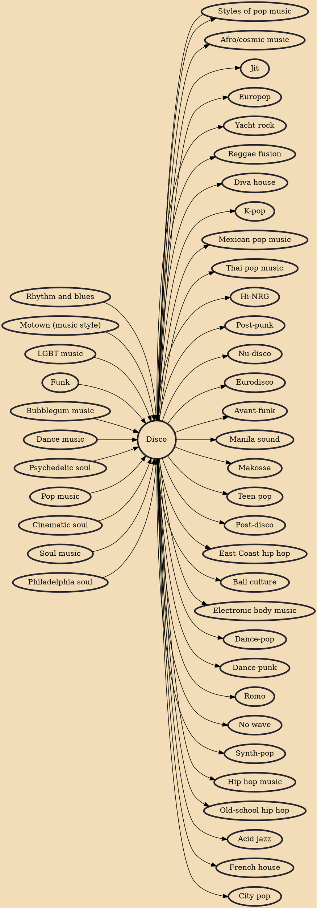

Disco is a genre of dance music and a subculture that emerged in the 1970s from the United States' urban nightlife scene. Its sound is typified by four-on-the-floor beats, syncopated basslines, string sections, horns, electric piano, synthesizers, and electric rhythm guitars.

## Influences

- [[Rhythm and blues]]
- [[Motown (music style)]]
- [[LGBT music]]
- [[Funk]]
- [[Bubblegum music]]
- [[Dance music]]
- [[Psychedelic soul]]
- [[Pop music]]
- [[Cinematic soul]]
- [[Soul music]]
- [[Styles of pop music]]
- [[Philadelphia soul]]

## Derivatives

- [[Afro/cosmic music]]
- [[Jit]]
- [[Europop]]
- [[Yacht rock]]
- [[Reggae fusion]]
- [[Diva house]]
- [[K-pop]]
- [[Mexican pop music]]
- [[Thai pop music]]
- [[Hi-NRG]]
- [[Post-punk]]
- [[Nu-disco]]
- [[Eurodisco]]
- [[Avant-funk]]
- [[Manila sound]]
- [[Makossa]]
- [[Teen pop]]
- [[Post-disco]]
- [[East Coast hip hop]]
- [[Ball culture]]
- [[Electronic body music]]
- [[Styles of pop music]]
- [[Dance-pop]]
- [[Dance-punk]]
- [[Romo]]
- [[No wave]]
- [[Synth-pop]]
- [[Hip hop music]]
- [[Old-school hip hop]]
- [[Acid jazz]]
- [[French house]]
- [[City pop]]
