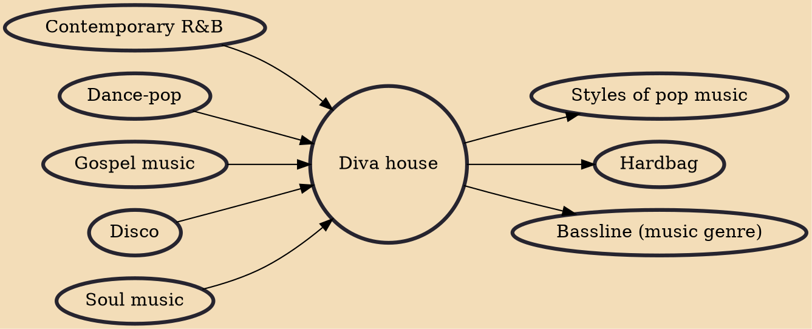

Diva house or handbag house is an anthemic subgenre of house music that became most popular in gay clubs during the second half of the 1990s. The Encyclopedia of Contemporary British Culture defines handbag house as having "prominent female vocals, breakdowns, and a proliferation of piano 'stabs'." Modern diva house compositions use synth stabs and four on the floor rhythms.

## Influences
- [[Contemporary R&B]]
- [[Dance-pop]]
- [[Gospel music]]
- [[Disco]]
- [[Soul music]]

## Derivatives
- [[Styles of pop music]]
- [[Hardbag]]
- [[Bassline (music genre)]]
