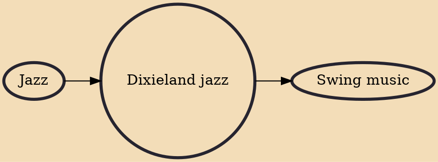

Dixieland jazz, also referred to as traditional jazz, hot jazz, or simply Dixieland, is a style of jazz based on the music that developed in New Orleans at the start of the 20th century. The 1917 recordings by the Original Dixieland Jass Band (which shortly thereafter changed the spelling of its name to "Original Dixieland Jazz Band"), fostered awareness of this new style of music.

## Influences
- [[Jazz]]

## Derivatives
- [[Swing music]]
