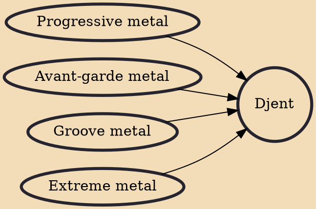

Djent (/dʒɛnt/) is a subgenre of progressive metal characterised by its use of off-beat and complex rhythm patterns. Its distinctive sound is that of high-gain, distorted, palm-muted, down-tuned strings. The name "djent" is an onomatopoeia of this sound.

## Influences
- [[Progressive metal]]
- [[Avant-garde metal]]
- [[Groove metal]]
- [[Extreme metal]]
