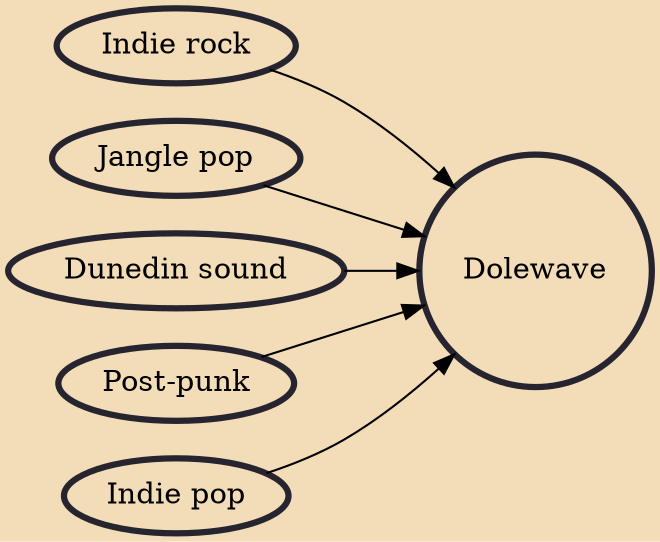

Dolewave is an Australian music genre that emerged in the early 2010s. Initially used online as an in-joke to describe an indie scene in Melbourne involving Twerps, Dick Diver and other groups, the term has since been applied by music critics to a wider range of Australian acts that share a DIY ethic and a "peculiarly and recognisably Australasian sound", such as Courtney Barnett and Rolling Blackouts Coastal Fever. Common influences include the 1980s jangle pop of Australian bands such as the Go-Betweens, as well as the lo-fi "Dunedin sound" of New Zealand's Flying Nun record label.

## Influences

- [[Indie rock]]
- [[Jangle pop]]
- [[Dunedin sound]]
- [[Post-punk]]
- [[Indie pop]]
