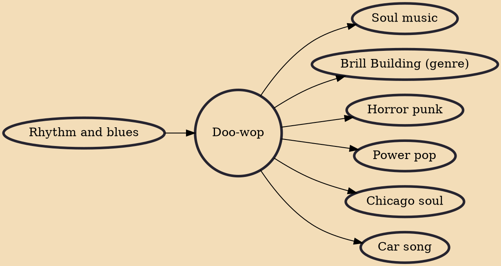

Doo-wop (also spelled doowop and doo wop) is a genre of rhythm and blues music that originated in African-American communities during the 1940s, mainly in the large cities of the United States, including New York, Philadelphia, Pittsburgh, Chicago, Baltimore, Newark, Detroit, Washington, DC, and Los Angeles. It features vocal group harmony that carries an engaging melodic line to a simple beat with little or no instrumentation. Lyrics are simple, usually about love, sung by a lead vocal over background vocals, and often featuring, in the bridge, a melodramatically heartfelt recitative addressed to the beloved. Harmonic singing of nonsense syllables (such as "doo-wop") is a common characteristic of these songs. Gaining popularity in the 1950s, doo-wop was "artistically and commercially viab

## Influences

- [[Rhythm and blues]]

## Derivatives

- [[Soul music]]
- [[Brill Building (genre)]]
- [[Horror punk]]
- [[Power pop]]
- [[Chicago soul]]
- [[Car song]]
