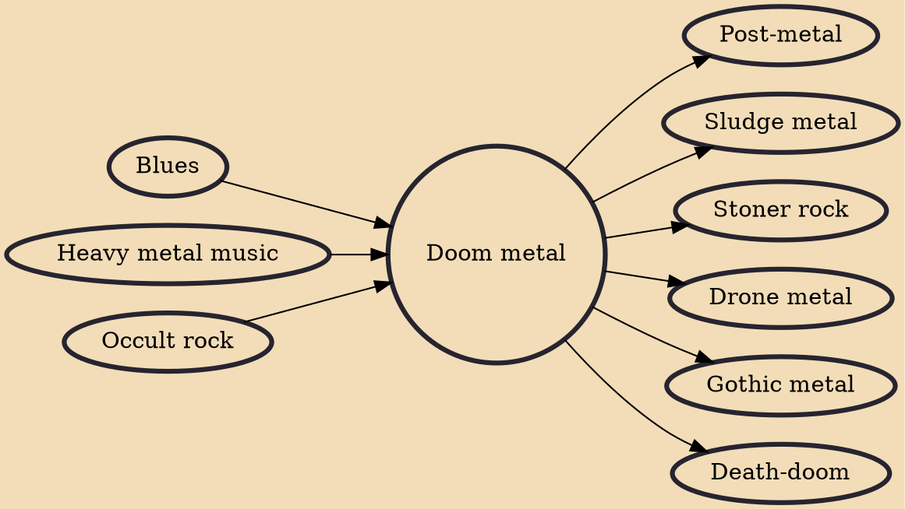

Doom metal is an extreme subgenre of heavy metal music that typically uses slower tempos, low-tuned guitars and a much "thicker" or "heavier" sound than other heavy metal genres. Both the music and the lyrics are intended to evoke a sense of despair, dread, and impending doom. The genre is strongly influenced by the early work of Black Sabbath, who formed a prototype for doom metal. During the first half of the 1980s, a number of bands such as Witchfinder General and Pagan Altar from England, American bands Pentagram, Saint Vitus, the Obsessed, Trouble, and Cirith Ungol, and Swedish band Candlemass defined doom metal as a distinct genre.

## Influences

- [[Blues]]
- [[Heavy metal music]]
- [[Occult rock]]

## Derivatives

- [[Post-metal]]
- [[Sludge metal]]
- [[Stoner rock]]
- [[Drone metal]]
- [[Gothic metal]]
- [[Death-doom]]
